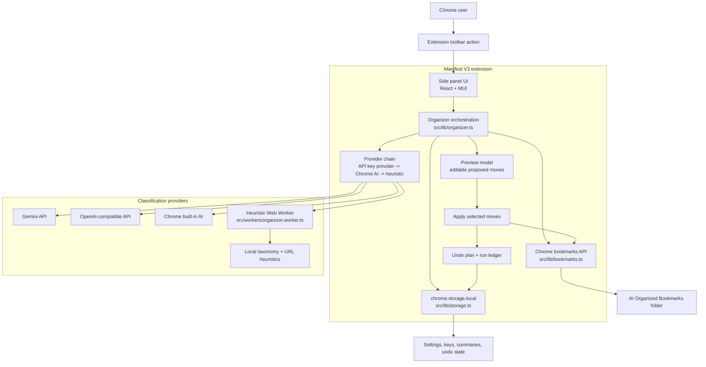

# AI Bookmark Organizer

<p align="center">
  
</p>

Manifest V3 Chrome extension that scans existing bookmarks, previews AI-suggested folder moves, and applies approved changes into a managed `AI Organized Bookmarks` folder.

## Screenshots

<p align="center">
  
</p>

<p align="center">
  
</p>

<p align="center">
  
</p>

## Download

The latest ready-to-install ZIP is available from the GitHub Releases page:

- [Download AI Bookmark Organizer v0.1.4](https://github.com/nothing-all-glitch/Ai-Bookmark-Sorter/releases/download/v0.1.4/ai-bookmark-organizer-v0.1.4.zip)
- [View all releases](https://github.com/nothing-all-glitch/Ai-Bookmark-Sorter/releases)

## Install In Chrome

Chrome extensions downloaded outside the Chrome Web Store must be loaded manually:

1. Download `ai-bookmark-organizer-v0.1.4.zip` from the release link above.
2. Unzip the downloaded file.
3. Open Chrome and go to `chrome://extensions`.
4. Enable **Developer Mode** in the top-right corner.
5. Click **Load unpacked**.
6. Select the unzipped extension folder.
7. Pin **AI Bookmark Organizer** from the Chrome extensions menu if you want quick access.

After installation, open the extension, review the proposed bookmark moves, then apply only the ones you want.

## Features

- Reads bookmarks through Chrome's `bookmarks` permission.
- Uses a provider fallback chain: saved API key AI, Chrome built-in AI, then deterministic local heuristics.
- Stores API keys only in `chrome.storage.local`.
- Skips bookmarks already inside the managed folder on later runs.
- Shows progress, pause/cancel controls, Chrome AI setup progress, preview editing, apply selected, and undo last run.
- Groups suggested moves into an expandable folder tree for easier review.
- Runs heuristic classification in a Web Worker when available.

## Architecture Design



The side panel is the only user-facing surface. It loads settings and a bookmark snapshot, then delegates scan, classification, preview, apply, and undo work to `src/lib/organizer.ts`.

Classification is intentionally defensive: the selected API provider runs first when configured, Chrome built-in AI is tried when available, and local heuristics keep the extension usable offline. The heuristic path runs in `src/workers/organizer.worker.ts` when Web Workers are available, with a direct fallback for test and constrained environments.

Bookmark writes are delayed until the user approves the preview. Applied moves go into the managed `AI Organized Bookmarks` folder, while `chrome.storage.local` keeps settings, API keys, the last run summary, and the undo plan inside the current Chrome profile.

## Development

```bash
npm install
npm run dev
npm test
npm run build
```

Load the built `dist` folder in `chrome://extensions` with Developer Mode enabled.
