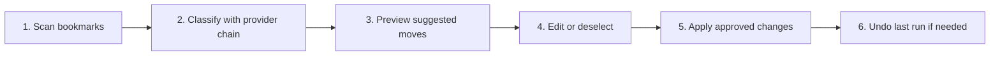
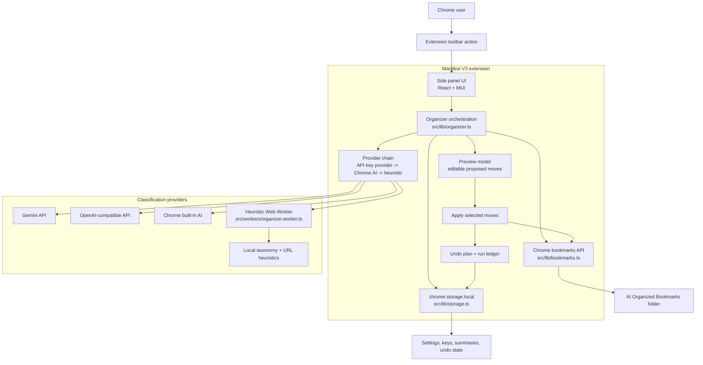

<div align="center">
  

  <h1>🤖 AI Bookmark Organizer</h1>

  **A Manifest V3 Chrome extension that turns messy bookmark bars into clean, reviewable folder systems.**

  <p>
    <a href="https://github.com/nothing-all-glitch/Ai-Bookmark-Sorter/releases">
      
    </a>
    
    
    
  </p>

  <p>
    <a href="#download">Download</a> •
    <a href="#screenshots">Screenshots</a> •
    <a href="#features">Features</a> •
    <a href="#development">Development</a>
  </p>
</div>

---

## ✨ Overview

AI Bookmark Organizer scans your existing Chrome bookmarks, suggests smarter folders, lets you preview and edit every proposed move, then applies only the changes you approve into a managed **AI Organized Bookmarks** folder.

It is built to be careful first: bookmark writes are delayed until review, API keys stay in `chrome.storage.local`, and classification falls back from API-based AI to Chrome built-in AI to local heuristics.

<a id="screenshots"></a>

## 📸 Screenshots

<table>
  <tr>
    <td width="50%">
      
      <br />
      <strong>Dashboard</strong>
      <br />
      Scan progress, controls, and run summary.
    </td>
    <td width="50%">
      
      <br />
      <strong>Review Preview</strong>
      <br />
      Expand folders, edit suggestions, and apply selected moves.
    </td>
  </tr>
  <tr>
    <td colspan="2">
      
      <br />
      <strong>Settings</strong>
      <br />
      Configure provider options, API keys, and classification behavior.
    </td>
  </tr>
</table>

<a id="download"></a>

## 🚀 Download

Grab the latest ready-to-install ZIP from GitHub Releases:

<p>
  <a href="https://github.com/nothing-all-glitch/Ai-Bookmark-Sorter/releases/download/v0.1.7/ai-bookmark-organizer-v0.1.7.zip">
    
  </a>
  <a href="https://github.com/nothing-all-glitch/Ai-Bookmark-Sorter/releases">
    
  </a>
</p>

## 🧩 Install In Chrome

Chrome extensions downloaded outside the Chrome Web Store must be loaded manually:

1. Download `ai-bookmark-organizer-v0.1.7.zip` from the release link above.
2. Unzip the downloaded file.
3. Open Chrome and visit `chrome://extensions`.
4. Enable **Developer Mode** in the top-right corner.
5. Click **Load unpacked**.
6. Select the unzipped extension folder.
7. Pin **AI Bookmark Organizer** from the Chrome extensions menu for quick access.

After installation, open the extension, review the proposed bookmark moves, then apply only the ones you want.

<a id="features"></a>

## 🛠️ Features

| Area | What it does |
| --- | --- |
| 🔎 Bookmark scanning | Reads bookmarks through Chrome's `bookmarks` permission. |
| 🧠 AI fallback chain | Tries saved API key AI, Chrome built-in AI, then deterministic local heuristics. |
| 🧪 API key check | Verifies a saved API key with a tiny test request and clearly shows when API sorting is active. |
| 🔐 Local key storage | Stores API keys only in `chrome.storage.local`. |
| 👀 Safe preview | Shows suggested folder moves before writing anything. |
| ✅ Selective apply | Applies only approved moves into `AI Organized Bookmarks`. |
| ↩️ Undo support | Keeps an undo plan and run ledger for the last applied organization run. |
| 🌳 Folder tree review | Groups suggested moves into expandable folders for easier scanning. |
| ⚙️ Worker-powered heuristics | Runs local classification in a Web Worker when available. |
| ⏸️ Flow controls | Includes progress, pause, cancel, setup progress, editing, and apply controls. |

## 🧭 How It Works



## 🏗️ Architecture Design



The side panel is the only user-facing surface. It loads settings and a bookmark snapshot, then delegates scan, classification, preview, apply, and undo work to `src/lib/organizer.ts`.

Classification is intentionally defensive: the selected API provider runs first when configured, Chrome built-in AI is tried when available, and local heuristics keep the extension usable offline. The heuristic path runs in `src/workers/organizer.worker.ts` when Web Workers are available, with a direct fallback for test and constrained environments.

Bookmark writes are delayed until the user approves the preview. Applied moves go into the managed `AI Organized Bookmarks` folder, while `chrome.storage.local` keeps settings, API keys, the last run summary, and the undo plan inside the current Chrome profile.

<a id="development"></a>

## 🧑‍💻 Development

```bash
npm install
npm run dev
npm test
npm run build
```

Load the built `dist` folder in `chrome://extensions` with Developer Mode enabled.

### Useful Scripts

| Command | Purpose |
| --- | --- |
| `npm run dev` | Start the Vite development server on `127.0.0.1`. |
| `npm test` | Run the Vitest suite once. |
| `npm run test:watch` | Run Vitest in watch mode. |
| `npm run build` | Type-check and build the production extension. |
| `npm run preview` | Preview the built app locally. |

## 📦 Tech Stack

<p>
  
  
  
  
  
</p>

---

<div align="center">
  <strong>Organize carefully. Review everything. Keep control of your bookmarks.</strong>
</div>
