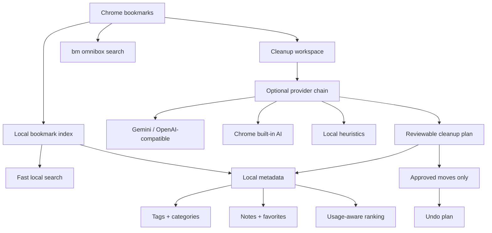

<div align="center">
  

  <h1>Recall — AI Bookmark Finder</h1>

  **Find anything you saved. Fast local search first, optional AI when it actually helps.**

  <p>
    
    
    
  </p>
</div>

---

## Releases & installation

Download packaged builds from **[GitHub Releases](https://github.com/nothing-all-glitch/Ai-Bookmark-Sorter/releases)**.

### Install a release in Chrome

1. Open the Releases page and download the extension **ZIP asset** for the version you want.
2. Unzip the downloaded file.
3. Open `chrome://extensions` in Chrome.
4. Turn on **Developer mode** in the top-right corner.
5. Click **Load unpacked**.
6. Select the unzipped extension folder — choose the folder that contains `manifest.json`.
7. Pin **Recall** from Chrome's Extensions menu for quick access.

> **Important:** use the packaged extension ZIP attached to the release when one is available, not GitHub's automatically generated “Source code” archive.

### Install the current source build

The repository source is currently **v0.2.1**. If the packaged Releases page has not caught up yet, build it locally:

```bash
npm install
npm run build
```

Then open `chrome://extensions` → enable **Developer mode** → **Load unpacked** → select the generated `dist` folder.

To update an unpacked installation later, replace/rebuild the files and click **Reload** on Recall's card in `chrome://extensions`.

## What changed in 0.2

Recall is a ground-up product and UI rethink of the original AI Bookmark Organizer.

The old extension was centered on a one-time workflow:

**scan → classify → preview → move**

Recall is centered on a daily workflow:

**save → search → open**

AI-assisted cleanup still exists, but it is now a secondary tool rather than the home screen.

## Core experience

### Find

The default screen is a fast local bookmark finder.

Search uses bookmark titles, URLs, domains, folder paths, local tags, AI/local descriptions, and your own notes. Results are ranked with fuzzy token matching plus lightweight relevance signals such as favorites and previous opens.

You can also:

- favorite bookmarks;
- add searchable notes;
- browse recent, unsorted, and duplicate bookmarks;
- save the current page from the side panel;
- see site favicons for faster visual scanning;
- search from Chrome's address bar with the `bm` keyword;
- open Recall with the configured keyboard shortcut.

### Clean up

Cleanup is deliberately non-destructive until you approve it.

Recall can:

1. scan bookmarks outside the managed folder;
2. classify them using the configured provider chain;
3. generate searchable descriptions and tags when the AI provider supports them;
4. show every proposed destination;
5. let you edit folders or deselect individual items;
6. apply only approved moves;
7. undo the last cleanup run.

### Settings

Search does not require AI.

Available organization modes:

- **Automatic** — API key first, then Chrome AI/local fallback.
- **Browser first** — Chrome built-in AI first, then local fallback.
- **Local only** — never call an external AI API.

Custom OpenAI-compatible endpoints use runtime optional host permissions. Recall asks for the specific custom host when it is saved rather than requesting broad host access at install time.

## Privacy model

The following stay in the browser profile:

- bookmark search index;
- favorites;
- notes;
- inferred local tags/categories;
- recent searches;
- open-frequency ranking signals;
- settings and API keys.

When an external AI provider is enabled for organization, bookmark titles, URLs, domains, and current folder information may be sent to that provider for classification.

## Quick usage

After loading the extension:

1. Open Recall from the toolbar.
2. Start typing — the search box is the main screen.
3. Press Enter to open the best result.
4. Use **Save** to bookmark the current page.
5. Type `bm`, then Space, in Chrome's address bar to search bookmarks without opening the side panel.
6. Open **Clean up** only when you want to review organization suggestions.

## Architecture


```mermaid
flowchart TD
  Chrome["Chrome bookmarks"] --> Index["Local bookmark index"]
  Index --> Search["Fast local search"]
  Index --> Metadata["Local metadata"]

  Metadata --> Tags["Tags + categories"]
  Metadata --> Notes["Notes + favorites"]
  Metadata --> Ranking["Usage-aware ranking"]

  Chrome --> Cleanup["Cleanup workspace"]
  Cleanup --> Providers["Optional provider chain"]
  Providers --> API["Gemini / OpenAI-compatible"]
  Providers --> ChromeAI["Chrome built-in AI"]
  Providers --> Local["Local heuristics"]

  Providers --> Preview["Reviewable cleanup plan"]
  Preview --> Metadata
  Preview --> Apply["Approved moves only"]
  Apply --> Undo["Undo plan"]

  Chrome --> Omnibox["bm omnibox search"]
```

## Development

```bash
npm install
npm test
npm run build
```

Load the generated `dist` directory from `chrome://extensions` with Developer Mode enabled.

### Useful commands

| Command | Purpose |
| --- | --- |
| `npm run dev` | Start the Vite development server. |
| `npm test` | Run the Vitest suite. |
| `npm run test:watch` | Run tests in watch mode. |
| `npm run build` | Type-check and build the extension. |

## Main source areas

| Path | Responsibility |
| --- | --- |
| `src/components/SearchView.tsx` | Finder, filters, favorites, notes, save-current-page flow. |
| `src/components/OrganizeView.tsx` | Safe cleanup preview/apply/undo experience. |
| `src/components/SettingsView.tsx` | Simplified AI/privacy settings and runtime permissions. |
| `src/lib/search.ts` | Bookmark indexing, metadata, ranking, duplicate normalization. |
| `src/lib/organizer.ts` | Classification orchestration and safe bookmark moves. |
| `src/service-worker.ts` | Side-panel shortcut and `bm` omnibox search. |

---

<div align="center">
  <strong>You don't need to remember where you saved it. Just remember what it was about.</strong>
</div>
